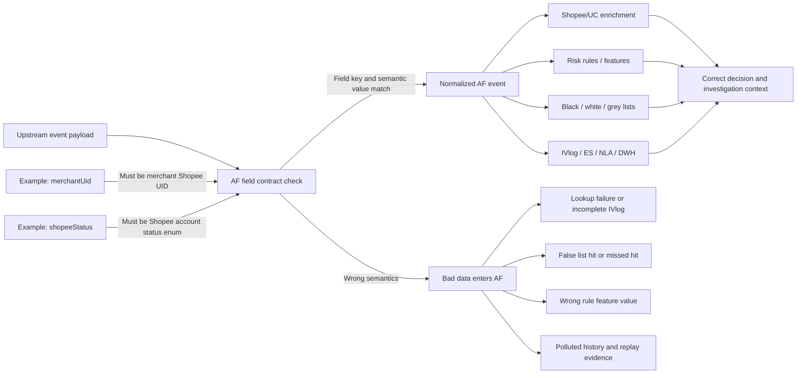

# AF Upstream Field Integration Contract

Last updated: 2026-04-30

This document is intended for team sharing. It is based on this week's SG live issue discussion around `merchantUid`, IVlog generation, and Shopee user status field semantics. The goal is to explain which upstream fields must not be populated arbitrarily, why they must not be populated arbitrarily, and what contract format should be used for future field integration.

## Conclusion

Fields in the AF event payload must not be treated as generic log attributes. Many of them are semantic contract fields in downstream AF flows: they may be copied into other dimensions, used for Shopee/UC enrichment, matched against black/white/grey lists, consumed as rule features, and persisted into IVlog/ES/NLA/DWH.

The list in this document is a high-risk field baseline compiled from the current local AF code archives, risk config, DB config, and this week's SeaTalk discussion. It can be used as the current team-sharing version, but it should not be claimed as a complete contract for all countries, versions, and scenes until it is reconciled with the production Apollo/config export and the AF-owned field dictionary.

## Why upstream must not pass arbitrary values

1. The field name itself is the contract.
   For example, `merchantUid` does not mean "any merchant id" in the current flow. It means the merchant's Shopee UID. In the SPM channel, AF may use it as a fallback value for `shopeeUid`.

2. Some fields are used as external lookup keys.
   Merchant info enrichment uses `shopeeUid` to query Shopee/UC. The request object is `List<Long> shopeeUids`. If upstream passes a merchant code, seller id, or string merchant id, enrichment may fail or IVlog may be incomplete.

3. Some fields are consumed by black/white/grey lists and rules.
   Fields such as `shopeeUid`, `shopeeTransUid`, `merchantcode`, `payeeShopId`, `cardMcc`, and `cardMerchantName` affect blacklist, whitelist, greylist, and rule matching. Incorrect values can cause false blocks, missed blocks, or hits on the wrong dimension.

4. Some fields become investigation evidence.
   IVlog, ES, NLA, DWH, replay, and debug flows may all read these fields. A wrong value does not only affect the current request; it can also pollute later investigations and historical evidence.

5. AF does not strongly validate every field.
   Some dimensions have validity checks, but not all fields do. The fact that AF accepts an event does not prove that the field semantics are correct.

## Confirmed code/config evidence

| Evidence | Meaning |
|---|---|
| `/Users/NPTSG0388/Documents/Project Archives/New-project-reference/AF_Codebases/anti-fraud-service-dbp-master/anti-fraud-service-dbp-master/anti-fraud-app/src/main/java/com/shopee/banking/af/core/app/service/event/impl/EventRecordServiceImpl.java` | In the SPM channel, `merchantUid` can fall back to `shopeeUid`; Shopee user enrichment fills `shopeeUid`, `shopeeUserName`, `shopeeStatus`, `shopeePhone`, and `shopeeEmail`. |
| `/Users/NPTSG0388/Documents/Project Archives/New-project-reference/AF_Codebases/dbp-antifraud-spi-feature-v1.0.57_20250620-SPDBP-63929/dbp-antifraud-dependencies-sdk/src/main/java/com/shopee/banking/antifraud/dependencies/sdk/impl/UserInfoSPIAdapterImpl.java` | Merchant info enrichment queries by `queryMerchantInfoDTO.shopeeUid`. |
| `/Users/NPTSG0388/Documents/Project Archives/New-project-reference/AF_Codebases/dbp-antifraud-spi-feature-v1.0.57_20250620-SPDBP-63929/dbp-antifraud-dependencies-sdk/src/main/java/com/shopee/banking/antifraud/dependencies/sdk/client/dto/QueryMerchantInfoReq.java` | The merchant info request structure is `List<Long> shopeeUids`. |
| `/Users/NPTSG0388/Documents/Project Archives/New-project-reference/AF_Codebases/anti-fraud-service-dbp-master/anti-fraud-service-dbp-master/anti-fraud-app/src/main/java/com/shopee/banking/af/core/app/service/list/impl/BlackWhiteListServiceImpl.java` | Extra fields are mapped into list dimensions such as `PHONE_NO` and `SHOPEE_UID`. |
| `/Users/NPTSG0388/Documents/Project Archives/New-project-reference/AF_Codebases/anti-fraud-service-dbp-master/anti-fraud-service-dbp-master/anti-fraud-app/src/main/java/com/shopee/banking/af/core/app/service/list/impl/GreyListServiceImpl.java` | Grey list logic reads `shopeeTransUid`, `shopeeUid`, `mobilePhoneNo`, `shopeeTransMobile`, `merchantcode`, `payeeShopId`, `shopeeMerchantID`, and `shopeeBusinessLine`. |
| `/Users/NPTSG0388/Documents/Project Archives/New-project-reference/AF_Codebases/dbp-antifraud-component-master/dbp-antifraud-component-master/dbp-antifraud-common/src/main/java/com/shopee/banking/af/component/common/constant/IdTypeEnum.java` | AF list dimensions include user, phone, device, IP, payee account, recipient mobile, merchant code, card, UEN, Shopee UID, shop, PayNow, token device, customer id, GPS hex, and more. |
| `/Users/NPTSG0388/Documents/Project Archives/New-project-reference/AF_Codebases/dbp-antifraud-component-master/dbp-antifraud-component-master/dbp-antifraud-common/src/main/java/com/shopee/banking/af/component/common/constant/ExtraFieldsConstant.java` | Extra field keys include Shopee user fields, recipient/payer/payee fields, merchant fields, card/shop fields, and Shopee transaction fields. |
| `/Users/NPTSG0388/Documents/Project Archives/New-project-reference/AF_Codebases/risk-config-master/risk-config-master/anti-fraud-service/v1.0.76_20260327/mysql/SG/DML/anti_fraud_db/v2.85_0407_anti_fraud_db_sg_dml.sql` | SG identifier config includes `shopeeUid`, `merchantUid`, `acquiringInstitutionIdCode`, and related fields. |

## Field contract format

Every field with downstream AF semantics should be maintained with the following contract format:

| Column | Meaning |
|---|---|
| `fieldKey` | Exact field name, including case. |
| `canonicalMeaning` | The only business meaning approved by AF. |
| `type` | `string`, `long`, `decimal`, `enum`, `boolean`, `list`, or object. |
| `format` | Regex, length, enum source, or external ID format. |
| `sourceOfTruth` | Authoritative source, such as Shopee/UC, Payment, Bank, Merchant Platform, or the upstream system. |
| `allowedSourceField` | Which upstream fields are allowed to map into this AF field. |
| `scenarioScope` | Applicable country, scene, action, channel, and event version. |
| `location` | Top-level event field, `extraInfo`, or nested object. |
| `requiredWhen` | Condition under which the field is required. |
| `nullable` | Whether the field may be empty or null. |
| `usedByAF` | `IVlog`, `rule`, `blacklist`, `whitelist`, `greylist`, `enrichment`, `NLA`, `DWH`, `ES`, etc. |
| `doNotUseFor` | Other meanings or IDs that must not be mixed into this field. |
| `validExample` | Valid example. |
| `invalidExample` | Invalid example. |
| `invalidHandling` | `reject`, `ignore`, `fallback`, `log only`, or `owner review`. |
| `owner` | AF owner and upstream owner. |
| `effectiveVersion` | Effective version/date. |

Example:

```text
fieldKey: merchantUid
canonicalMeaning: Merchant's Shopee UID
type: long
sourceOfTruth: Shopee/UC merchant profile
location: extraInfo or event field, depending on scene contract
usedByAF: SPM fallback to shopeeUid, merchant info enrichment, IVlog
doNotUseFor: merchantCode, sellerId, business merchant id, payee uid
validExample: 341874123
invalidExample: "MCHT-SG-001", "seller_123", "abc"
```

```text
fieldKey: shopeeStatus
canonicalMeaning: Shopee account status
type: enum
sourceOfTruth: Shopee/UC
usedByAF: Shopee user enrichment, IVlog, NLA/DWH
doNotUseFor: upstream business status, payment account status, KYC status
```

## Current high-risk field list

| Field | AF-approved meaning | Type/format | Source of truth | AF usage | Must not be mixed with |
|---|---|---|---|---|---|
| `shopeeUid` | Shopee account UID | long or integer string | Shopee/UC | Shopee user enrichment, rule/list, IVlog | merchant code, seller id, internal user id, payment account id |
| `shopeeStatus` | Shopee account status | Shopee/UC account status enum | Shopee/UC | Shopee user enrichment, IVlog, NLA/DWH | upstream business status, payment status, KYC status |
| `shopeeUserName` | Shopee account username | Shopee profile string | Shopee/UC | IVlog, investigation context | business display name, merchant legal name |
| `shopeePhone` | Shopee account phone | Shopee profile phone | Shopee/UC | IVlog, investigation context | payment mobile, recipient mobile unless Shopee-confirmed |
| `shopeeEmail` | Shopee account email | Shopee profile email | Shopee/UC | IVlog, investigation context | business contact email unless Shopee-confirmed |
| `shopeeTransUid` | Shopee UID of the transaction counterparty | long or integer string | Transaction/Shopee | `SHOPEE_UID` list dimension | ordinary recipient uid, merchant code |
| `shopeeTransMobile` | Shopee mobile of the transaction counterparty | phone string | Transaction/Shopee | `PHONE_NO` list dimension | bank mobile, non-Shopee phone unless explicitly mapped |
| `merchantUid` | Merchant's Shopee UID | long | Shopee/UC merchant profile | SPM fallback to `shopeeUid`, merchant enrichment, IVlog | merchant code, seller id, string merchant id, payee uid |
| `merchantcode` | Merchant code | string code | Merchant platform/payment | `MERCHANT_CODE` list dimension | Shopee UID, shop id |
| `merchantCode` | Merchant code variant | string code | Merchant platform/payment | merchant context / extra field | Shopee UID, shop id |
| `shopeeMerchantID` | Shopee merchant identifier | long or config-defined ID | Shopee merchant domain | grey list / config-specific dimension | `merchantcode`, `merchantUid` unless explicitly equivalent by contract |
| `shopee_merchant_id` | Snake_case Shopee merchant identifier | long or config-defined ID | Shopee merchant domain | DB/config identifier dimension | camelCase fields with different semantics |
| `shopeeBusinessLine` | Shopee merchant business line | enum/string | Shopee merchant domain | grey list dimension | upstream custom business line name |
| `shopId` | Shopee shop ID | long or integer string | Shopee shop domain | shop/list/investigation context | merchant UID, merchant code |
| `payeeShopId` | Payee's Shopee shop ID | long or integer string | Payment/Shopee shop domain | `SHOP_ID` list dimension | payer shop id, merchant code |
| `shopName` | Shopee shop name | shop profile string | Shopee shop domain | IVlog, investigation context | merchant legal name unless from the same source |
| `shopStatus` / `shopShopeeStatus` | Shopee shop status | shop status enum | Shopee shop domain | IVlog/NLA/shop context | Shopee account status, order status |
| `shopShopeeUid` | Shopee UID bound to the shop | long | Shopee shop domain | shop owner linkage | shop id, merchant code |
| `uid` | Main user ID of the current event | scene-defined | upstream scene owner | identifier/rule/list | Shopee UID unless explicitly equivalent by scene contract |
| `mobilePhoneNo` | User mobile number | phone string | upstream/KYC/customer profile | `PHONE_NO` dimension | Shopee transaction mobile unless explicitly mapped |
| `deviceId` | Device ID | string | upstream device source | device rule/list | token device, CNP device unless explicitly mapped |
| `ipAddress` | Client IP | IPv4/IPv6 | gateway/device source | IP rule/list | country/city text |
| `email` | Customer email | email string | customer profile/upstream | identifier/rule | Shopee email unless from the same source |
| `accountId` | Account ID | string/long | account system | identifier/rule | bank account number unless specified by contract |
| `idNo` | Identity document number | string | KYC/customer profile | ID/rule | customer id, account id |
| `customerIdNo` | Customer identity document number | string | KYC/customer profile | `CUSTOMER_ID_NO` dimension | internal customer id |
| `customerId` | Customer ID | string/long | customer system | `CUSTOMER_ID` dimension | identity document number |
| `indivUid` | Individual customer UID | long/string | customer system | identifier / release-uplift context | corporate UID |
| `corpUid` | Corporate customer UID | long/string | customer system | identifier / release-uplift context | individual UID |
| `recipientMobileNo` | Recipient mobile number | phone string | payment/transfer domain | `RECIPIENT_MOBILE_NO` dimension | sender mobile, Shopee mobile unless the recipient is Shopee-confirmed |
| `recipientAccountNo` | Recipient account number | account number string | payment/bank | recipient account dimension | phone number, UID |
| `recipientBankName` | Recipient bank | bank name/code | payment/bank | recipient bank dimension | payer bank |
| `recipientName` | Recipient name | string | payment/bank | investigation/rule context | payer name |
| `payeeAccount` | Payee account | account number/string | payment/bank | payee account dimension, INCOMING_FUNDS preprocessing | UID, mobile, merchant id |
| `payerAccount` | Payer account | account number/string | payment/bank | payer/payment context | payee account, UID |
| `payerBank` | Payer bank | bank name/code | payment/bank | payment context | recipient bank |
| `paynowProxyType` | PayNow proxy type | PayNow enum | Payment/PayNow | PayNow proxy dimension | proxy value |
| `paynowProxyValue` | PayNow proxy value | string matching proxy type | Payment/PayNow | PayNow proxy dimension | account number unless the type requires it |
| `uen` / `UEN` | Singapore UEN | UEN format | SG entity source | UEN rule/list | merchant code, tax id from another country |
| `cardIdentifier` | Card identifier | card token/id format | card/payment domain | card list dimension | plain card number unless explicitly approved |
| `cardCnpTxnDevice` / `cnpTxnDevice` | CNP transaction device | device string | card/payment domain | card CNP dimension | generic device id unless from the same source |
| `cardMcc` / `mcc` | Merchant category code | MCC code | card/acquiring domain | MCC rule/list | merchant code |
| `cardMerchantName` | Card transaction merchant name | acquiring merchant name | card/acquiring domain | card merchant rule/list | shop name unless from the same source |
| `cardTerminalCode` / `terminalCode` | Card terminal code | terminal code string | card/acquiring domain | terminal dimension | merchant code |
| `tokenDevice` | Token device identifier | token device id | token/payment domain | token device dimension | generic device id unless explicitly equivalent |
| `country` | Country | ISO/canonical country | geo/source system | country dimension | city, nationality unless specified by contract |
| `city` | City | canonical city | geo/source system | city dimension | country |
| `gpsHex11` | GPS hex precision 11 | geo hex string | geo/source system | GPS rule/list | raw lat/lon text |
| `gpsHex12` | GPS hex precision 12 | geo hex string | geo/source system | GPS rule/list | raw lat/lon text |
| `gpsHex13` | GPS hex precision 13 | geo hex string | geo/source system | GPS rule/list | raw lat/lon text |
| `gpsHex14` | GPS hex precision 14 | geo hex string | geo/source system | GPS rule/list | raw lat/lon text |
| `acquiringInstitutionIdCode` | Acquiring institution ID code | acquirer code string | card/acquiring domain | SG config identifier dimension | merchant id, bank name |

## Shopee user status conclusion

`shopeeStatus` must only represent Shopee account status. It should come from Shopee/UC, or from a source explicitly approved by both AF and the Shopee owner as equivalent.

If upstream only has its own status, it must use a separate field, for example:

- `paymentUserStatus`
- `upstreamUserStatus`
- `kycStatus`
- `walletAccountStatus`
- `merchantOnboardingStatus`

Do not put those statuses into `shopeeStatus`.

## New integration review checklist

Before PRD review, UAT, or backend integration, check every field:

1. Does the field name already exist in AF constants, identifier config, list dimensions, or Apollo/DB config?
2. If yes, does the upstream value match AF's canonical meaning?
3. Is the source of truth documented?
4. Are the type, format, and enum documented?
5. Will the field enter enrichment, rules, blacklist, whitelist, greylist, IVlog, ES, NLA, or DWH?
6. Does UAT cover a negative case with a similar but incorrect ID?
7. Is invalid-value handling defined as reject, ignore, fallback, or owner review?

## Shareable diagram

Mermaid source:

`/Users/NPTSG0388/Documents/New project/docs/af-upstream-field-contract-flow.mmd`

SVG that can be opened/shared directly:

`/Users/NPTSG0388/Documents/New project/docs/af-upstream-field-contract-flow.svg`



## Ownership model

The AF owner is responsible for the field contract, downstream usage, and invalid-value handling. The upstream owner is responsible for source mapping, sample payloads, and negative examples. Product and UAT should review the field contract table, not only the PRD wording.
